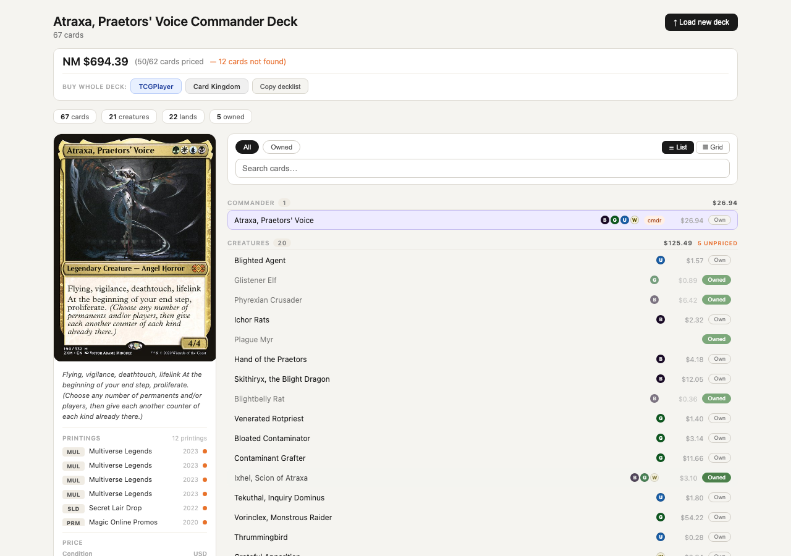
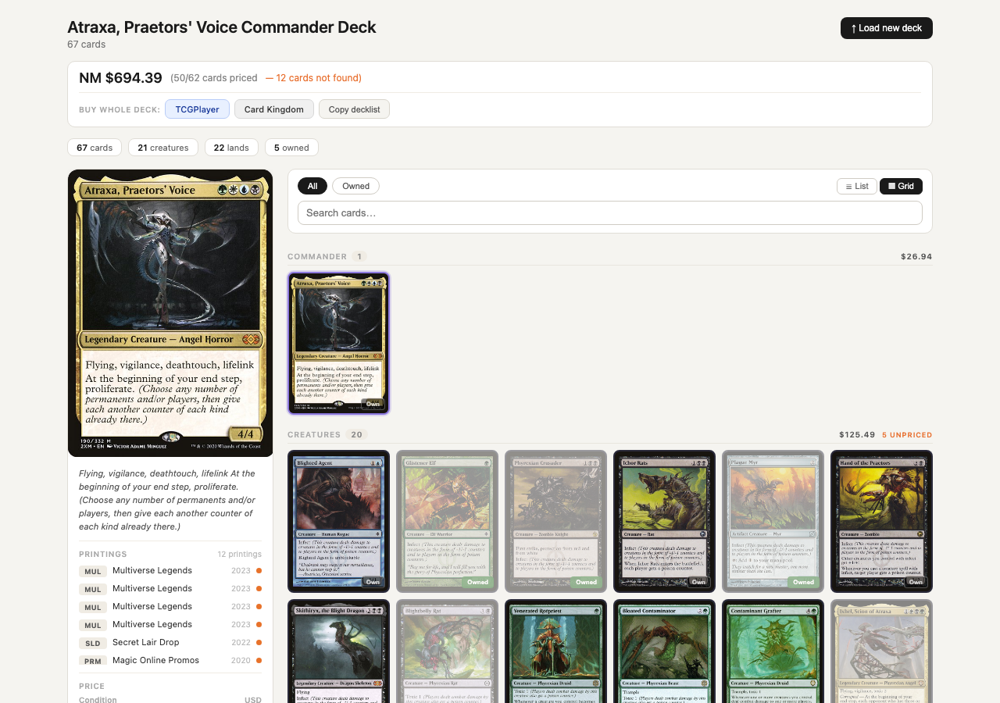
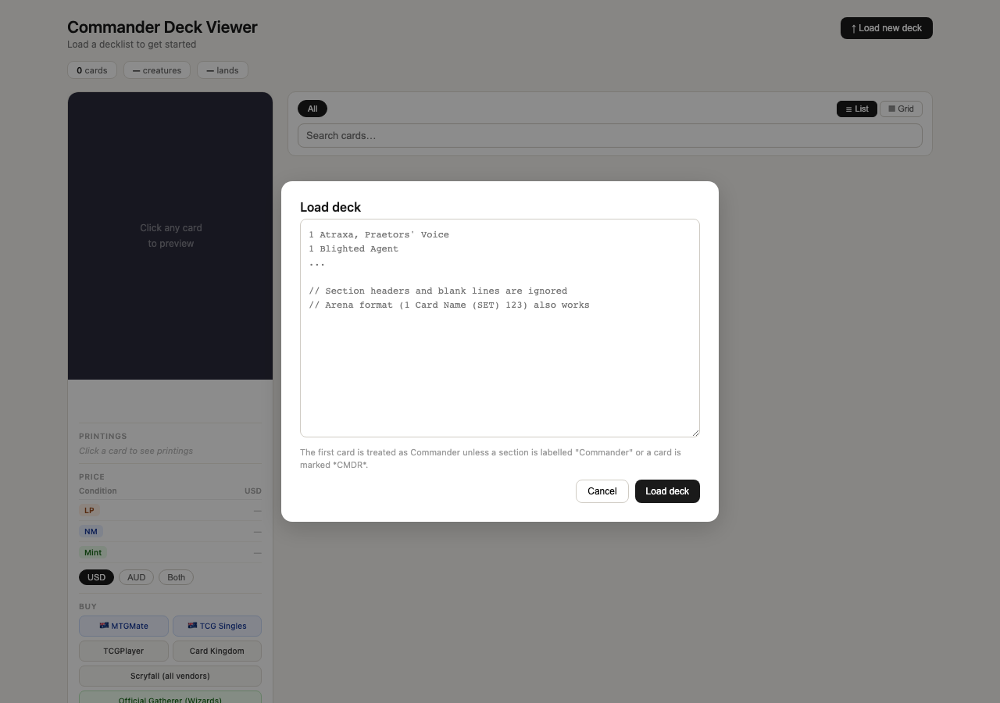
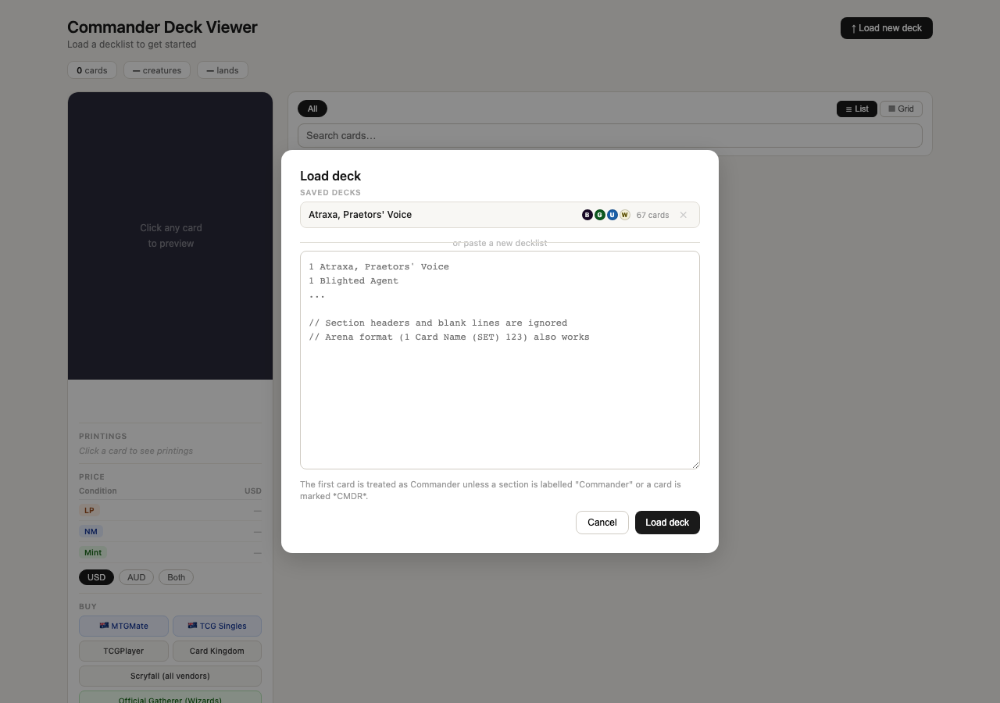

# Manifest

**Your Commander deck, manifested.** Paste a decklist, see every card, check every price, buy what you need. One HTML file. No installs. No accounts. No nonsense.



## What it does

Manifest turns a raw decklist into an interactive, visual deck viewer with live pricing from Scryfall. Paste your list from Moxfield, Archidekt, MTGO, or Arena and you're rolling.

- **Card preview** with art, oracle text, mana cost, and every printing across Magic's history
- **Live prices** in USD and AUD across LP, NM, and Mint conditions
- **Mark cards as owned** so you only buy what you're missing
- **One-click bulk buy** links to TCGPlayer and Card Kingdom (owned cards excluded automatically)
- **Saved decks** persist between sessions so you can switch between brews instantly
- **Banned card detection** for Commander format
- **List and grid views** because sometimes you want to see the art

## Screenshots

### Grid view
Browse your deck visually with full card art, owned indicators, and category breakdowns.



### Load & save decks
Your decks are saved locally with commander name and color identity. Come back anytime.

| First visit | Returning |
|:-:|:-:|
|  |  |

## Usage

```
open index.html
```

That's it. One file, zero dependencies, runs entirely in your browser.

Paste a decklist in any of these formats:
- **Moxfield** / **Archidekt** exports
- **MTGO** format (`1 Card Name`)
- **Arena** format (`1 Card Name (SET) 123`)

The first card is treated as Commander unless you label a section `// Commander` or mark a card with `*CMDR*`.

## Tech

- Vanilla HTML + CSS + JS in a single file
- [Scryfall API](https://scryfall.com/docs/api) for card data, images, and pricing
- localStorage for persisting decks and owned cards
- No build step, no framework, no backend, no API keys
